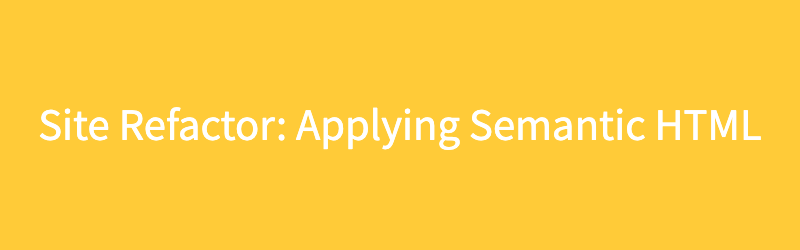
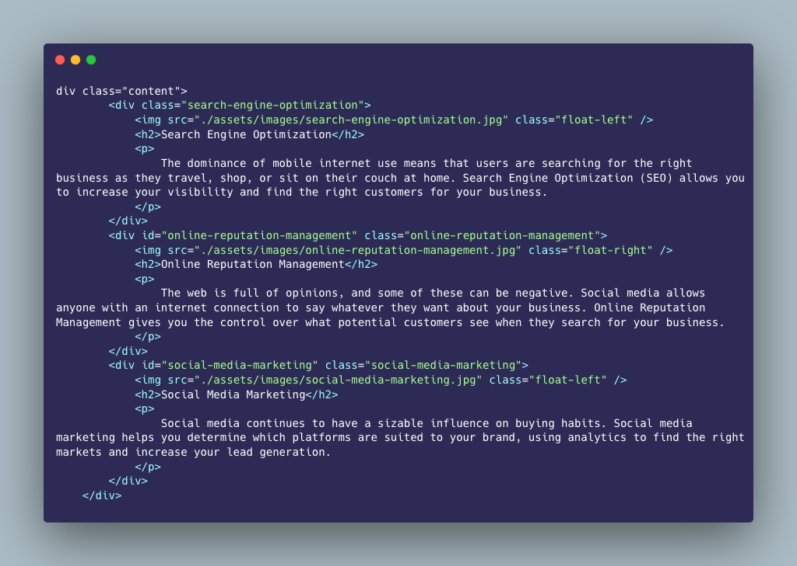
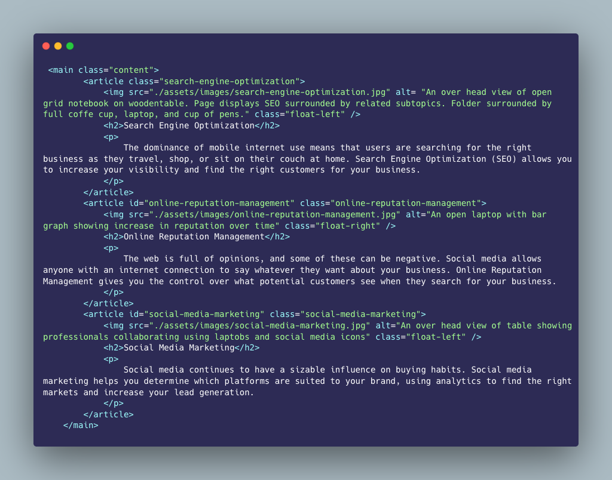
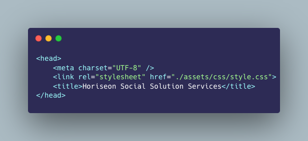
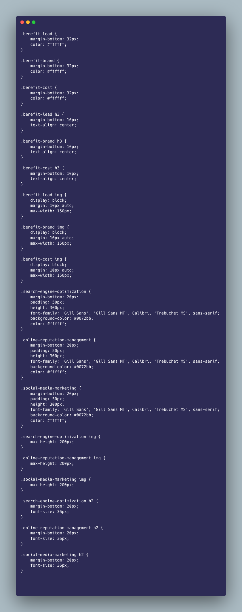
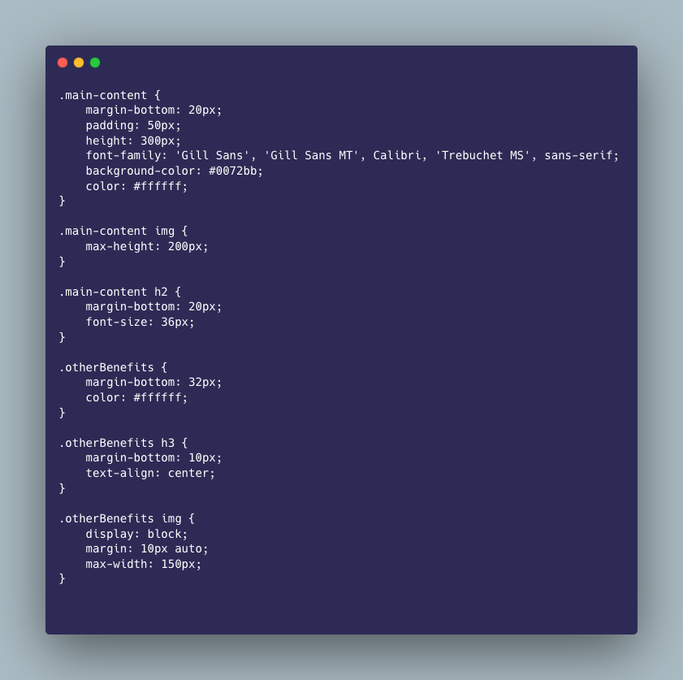

# Site-Refactor

## Description
The purpose of this project was to update a previous code base to comply with modern semantic HTML standards. These standards improve the experience of the site for those with disbalities by providing necessary information for software such as site readers. In addition, these changes improve search engine optimazation. Finally a review was completed to consolidate duplicate styling and ensure the logical strucure of all elements. 

### Goals
Give our previous code base the goals were to:

1. Update non-semantic HTML to semantic HTML
2. Update all icon and image elements with `alt` tags
3. Optimize the title to be concise and descriptive
4. Ensure all elements follow a logical structure independent of styling and positioning
5. Ensure the sequential order of all heading attributes.

Below are some samples of the changes made. It is important to note that these changes have no impact on the overall appearance of the site itself. However, they add vital funcionality for accesibility software and add greater context to the site for search engine optimazation.

- **Non Semantic**. Old code utilized `div` tags and lacked `alt` tags.

- **Semantic**. Replaced `div` tags with `main` and `article` tags and added `alt` information.

- **Old Title**

.png)

- **New Title**

- **Consolidated CSS**

to

## Installation
N/A

## Usage
This site is for demonstration purposes only. 

## Credits
N/A

## License
N/A